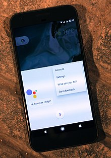

## Idées de Sujet pour le Travail De fin d'Année.

### Reconnaissance Faciale.

_Ayant acquis depuis peu un nouveau téléphone étant équipé du logiciel de reconnaissance faciale, j'aimerais en savoir un peu plus sur le fonctionnement de celui-ci._

**Sources pistes :**  

- [Lien Wikipédia](https://fr.wikipedia.org/wiki/Syst%C3%A8me_de_reconnaissance_faciale)
- [Les différentes utilisations de cette technologie](https://www.gemalto.com/france/gouv/biometrie/reconnaissance-faciale)

### Assistance vocale/personnel (type Siri, Google Assistant, etc.)

_s'étant invité sur nos appareils électroniques depuis une décennie déjà, j'aimerai découvrir ce qui se cache derrière les logiciels des assistants personnels et les capacités de reconnaître les voix et les commandes suggérés dans les différentes langues_

**Sources pistes :**

- [Lien Wikipédia](https://fr.wikipedia.org/wiki/Assistant_personnel_intelligent)
- [Lien Vidéo explicative](https://www.lorigine.fr/un-assistant-vocal-comment-ca-marche/)

